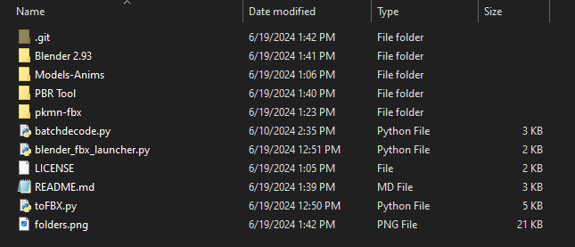

# PBR-Exporting
A program used to convert the .SDR files, used in Pokémon Battle Revolution, to .FBX with all animations.

## Installing
1. Download or clone this projects code and unzip it
2. Download Blender 2.93 portable and unzip it to this projects folder (root) and name the folder contaning it "Blender 2.93"  
     **Inside this folder should be Blender.exe, if not you have done something wrong.**  
3. Download my fork of the PBR Blender addon [Here](https://github.com/Drizz1le/pbr-models-import-export) & follow the instructions to install it to Blender 2.93
4. Download PBR Tool from the [Gamecube/Wii Rom hacking Discord](https://discord.gg/BtgdmH95v6) and go [Here](https://discord.com/channels/753272785286987897/753273128628518993/753275580484681882)
5. Put this tool into the root directory, make sure to unzip it!
6. Make a folder called "Models-Anims" and "pkmn-fbx"

## Dumping ROM
### **You must rip your own rom from your own disc! I will not be providing a download link to the .iso file!**  
Once you have ripped your rom, unpack it using PBR Tool by dragging and dropping it onto it. Make sure you install its prerequisites first! 
Go to the folder with your extracted rom and go to .\Game Files\Dump\DATA\files  
In their you need to copy all files like this: pkx_###.fsys 
-------------- OR -------------- 
Only the pokemon you want to export, the number is their national dex number.  
Paste those files into "Models-Anims" 

## Running the programs
1. Run batchdecode.py, If you get an error your folders are not set up correctly and you need to fix it.
2. You now should have a bunch of folders like "pkx_###" in Models-Anims. In those pkx folders their should be files named "pkx_### 0000.sdr"
3. If that worked, run blender_fbx_launcher.py and wait for all the fbx files to be proccessed.  
This took me around 45 minutes for all of the pokemon, but it may vary depending on how good your PC is.
4. All of your .FBX files should be in the pkmn-fbx folder

## Notes:
> Does not export with textures! 
> May take a while on lower end PC's 
> Gets rid of sleeping animations because they are only a frame long and just have their eyes shut. Also kinda broken

### If you found this useful please leave a star!
